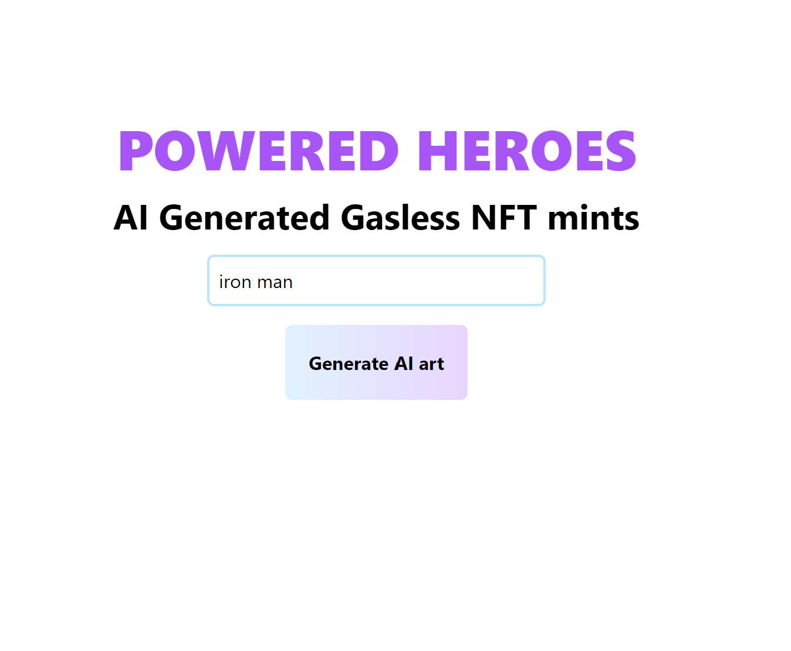
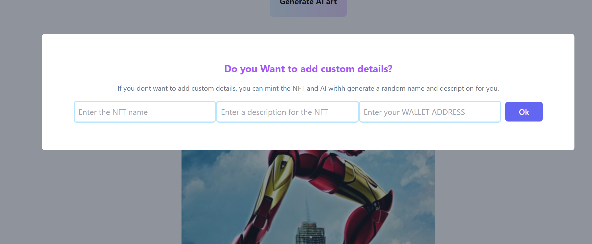
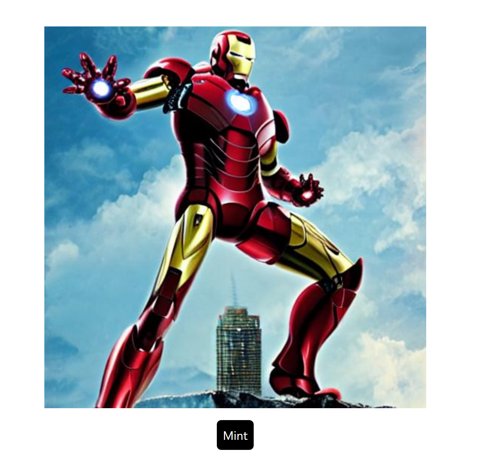
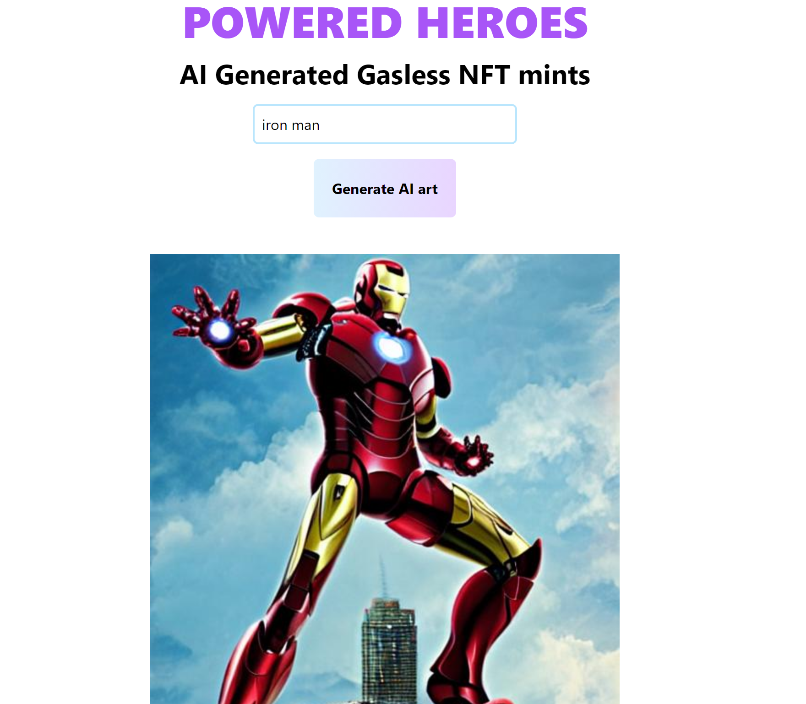
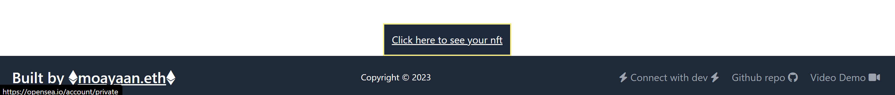

# POWERED HEROES

Deployed LINK :-https://powered-heroes.vercel.app/

## Video DEMO

Link:- [Video Demo on Youtube](https://youtu.be/MZUSn3nxb3U)

## Preview







---

## Built With

- [NextJS](https://nextjs.org/) - Web framework for React applications
- [NFT Storage](https://nft.storage/) - Store images as IPFS hashes for use with NFTs
- [NFT Port](https://nftport.xyz/) - Minting platform for Ethereum and Polygon networks
- [Hugging Face](https://huggingface.co/models) - Diffusion model for generating AI art
- [Tailwind Css](https://tailwindcss.com/)- Css Library with custom classes to style components
- [Axios](https://axios-http.com/)-HTTP client for fetching data
- [dotenv](https://www.npmjs.com/package/dotenv)-Dependency to load environment variables
- [React Toastify](https://www.npmjs.com/package/react-toastify)-Package to create stylish toasts

## Features

- Generate AI art using Hugging Face's Diffusion model
- Mint the generated art as an NFT on Polygon **WITHOUT GAS**
- Add custom details to the NFT like name, description and wallet address
- Check your minted NFT on OpenSea's private section

## RUN ON YOUR LOCAL MACHINE

Follow the Steps to run this app on your local machine.

1. Clone this repo
   ```
   git clone
   ```
2. Install all dependencies using npm or yarn
   ```
   npm i
   ```
   Or
   ```
   yarn
   ```
3. Create and Fill .env file. See .env.example for reference
4. Run the app
   ```
   npm run dev
   ```
   OR
   ```
   yarn dev
   ```

# About the Developer

Hello everyone, myself **Mohammad Ayaan Siddiqui** from India. I am a Full Stack WEB3 developer and a **DECENTRALIZATION MAXI**. I talk about WEB3, Cryptocurrencies, Javascript and Python and currently learning web3.

**Currently Learning and Building in React.js, Next.js, Solidity, Golang, Hardhat, Ethers.js, React Native, Tailwind, Html, CSS, Python, etc.**

<p align="center">

</p>

If you are interested in either of the topics or building in similar skills, connect with me below:-

1.  [My Linktree with ALL SOCIALS](https://linktr.ee/ayaaneth)

2.  [Connect on Github](https://github.com/moayaan1911)

3.  [Connect on Linkedin](www.linkedin.com/in/ayaaneth)

4.  [Connect on Twitter](https://www.twitter.com/usdisshitcoin)

5.  [Connect on Telegram](https://t.me/usdisshitcoin)

6.  [Connect on dev.to](https://dev.to/moayaan1911)
